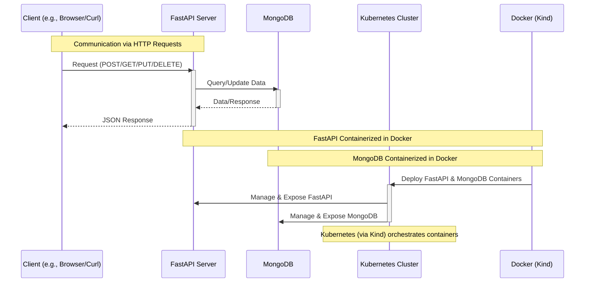

# FastAPI-MongoDB-Kubernetes

```mermaid
sequenceDiagram
    participant Client as Client (e.g., Browser/Curl)
    participant FastAPI as FastAPI Server
    participant MongoDB as MongoDB
    participant K8s as Kubernetes Cluster
    participant Docker as Docker (Kind)

    Note over Client,FastAPI: Communication via HTTP Requests

    Client->>FastAPI: Request (POST/GET/PUT/DELETE)
    activate FastAPI
    FastAPI->>MongoDB: Query/Update Data
    activate MongoDB
    MongoDB-->>FastAPI: Data/Response
    deactivate MongoDB
    FastAPI-->>Client: JSON Response
    deactivate FastAPI

    Note over FastAPI,Docker: FastAPI Containerized in Docker
    Note over MongoDB,Docker: MongoDB Containerized in Docker

    Docker->>K8s: Deploy FastAPI & MongoDB Containers
    activate K8s
    K8s->>FastAPI: Manage & Expose FastAPI
    K8s->>MongoDB: Manage & Expose MongoDB
    deactivate K8s

    Note over K8s: Kubernetes (via Kind) orchestrates containers

```
