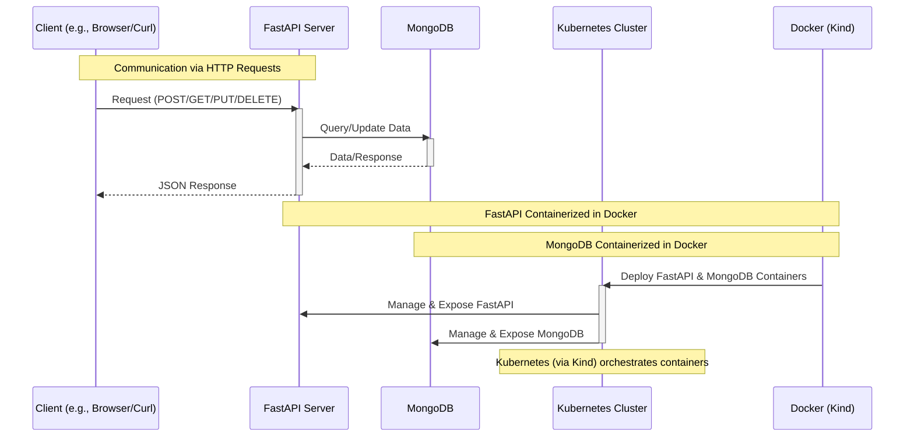

# FastAPI Application with MongoDB, Dockerized and Orchestrated using Kubernetes (Kind)

This project is part of my coursework for the Cloud Software and Systems course offered by the Department of Computer Science at Aalto University. It demonstrates my proficiency in backend development, containerization, and orchestration through the creation of a FastAPI application integrated with a MongoDB database, all containerized and managed using Docker and Kubernetes (Kind).

Key Features and Technologies:

1. FastAPI: Utilized for building a high-performance, RESTful API. The application processes various HTTP requests and returns responses in JSON format.

2. MongoDB: Chosen as the NoSQL database, it efficiently stores and manages course and student data.

3. Docker: Used to containerize both the FastAPI application and MongoDB, facilitating consistent deployment across different environments.

4. Kubernetes (Kind): Employs Kubernetes in a local development environment using Kind for orchestrating the FastAPI and MongoDB containers, showcasing skills in container orchestration, deployment, and management.

```File structure
.
├── LICENSE
├── README.md
├── backend
│   ├── Dockerfile
│   ├── main.py
│   └── requirements.txt
├── manifests
│   ├── fastapi.yaml
│   ├── mongo.yaml
│   └── persistent-volume.yaml
└── script.sh
```


